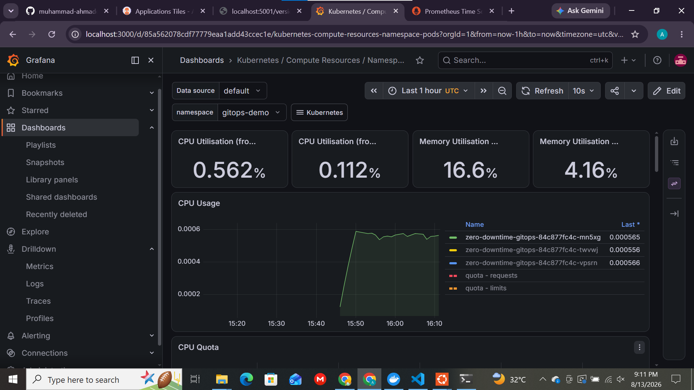
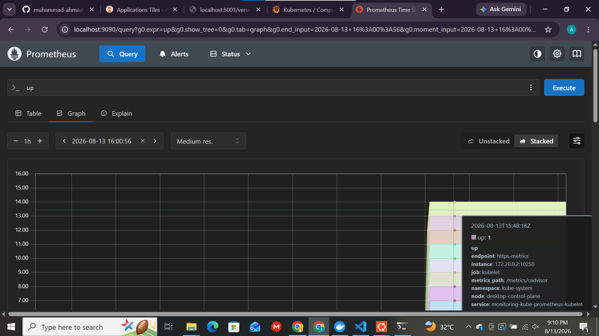

# k8s-monitoring-stack

Production-ready Kubernetes observability stack built on Prometheus and Grafana, deployed via Helm. This project provides cluster-wide monitoring, metrics collection, visualization, and alerting with a streamlined deployment process.


---

## Overview

This repository provides a ready-to-deploy monitoring stack for Kubernetes clusters using the kube-prometheus-stack Helm chart. It includes:

- Prometheus for metrics collection and storage
- Grafana for dashboards and visualization
- Alertmanager for alert routing and notifications
- Node Exporter for node-level metrics
- kube-state-metrics for Kubernetes object monitoring

Custom Helm values are included for Prometheus and Grafana, enabling persistent storage, resource limits, and operational dashboards suitable for development and small-scale production environments.

## Features

- Cluster-wide metrics collection using Prometheus
- Preconfigured Grafana dashboards for visualization
- Kubernetes object monitoring with kube-state-metrics
- Node-level monitoring through Node Exporter
- Alert routing and notification management with Alertmanager
- Persistent storage configuration for monitoring data
- Helm-based deployment and lifecycle management
- Dedicated monitoring namespace for workload isolation

## Architecture

```text
                ┌─────────────────┐
                │     Grafana      │
                └────────┬─────────┘
                         │
                ┌────────▼─────────┐
                │    Prometheus     │
                └───┬─────────┬────┘
                    │         │
        ┌───────────▼─┐   ┌───▼─────────────┐
        │ Node Exporter│   │ kube-state-metrics│
        │ (per node)   │   │ (cluster objects) │
        └──────────────┘   └────────────────────┘
                    │
             ┌──────▼──────┐
             │ Alertmanager │
             └─────────────┘
```

## Repository Structure

```text
k8s-monitoring-stack/
├── monitoring/
│   ├── namespace.yaml
│   ├── prometheus-values.yaml
│   └── grafana-values.yaml
├── screenshots/
│   ├── Grafana.png
│   └── Prometheus.png
├── LICENSE
└── README.md
```

## Prerequisites

- Kubernetes cluster (tested on k3s)
- Helm 3
- kubectl configured with cluster access
- Internet access for Helm chart downloads

## Quick Start

```bash
# Clone the repository
git clone https://github.com/muhammad-ahmadd-shafiq/k8s-monitoring-stack.git

cd k8s-monitoring-stack

# Add Helm repository
helm repo add prometheus-community https://prometheus-community.github.io/helm-charts

helm repo update

# Create namespace
kubectl apply -f monitoring/namespace.yaml

# Deploy monitoring stack
helm install monitoring prometheus-community/kube-prometheus-stack \
  -n monitoring \
  -f monitoring/prometheus-values.yaml \
  -f monitoring/grafana-values.yaml
```

## Verify Installation

```bash
kubectl get pods -n monitoring

kubectl get svc -n monitoring

helm list -n monitoring
```

Expected output:

- Prometheus pods in Running state
- Grafana pod in Running state
- Alertmanager pod in Running state
- Monitoring services exposed inside the cluster

## Accessing Grafana

Forward the Grafana service locally:

```bash
kubectl port-forward -n monitoring svc/monitoring-grafana 3000:80
```

Open:

```text
http://localhost:3000
```

Default credentials:

| Service | Username | Password |
|----------|----------|----------|
| Grafana | admin | prom-operator |

It is recommended to change the default password before using the stack in a shared environment.

## Accessing Prometheus

```bash
kubectl port-forward -n monitoring svc/monitoring-kube-prometheus-prometheus 9090:9090
```

Open:

```text
http://localhost:9090
```

## Configuration

### Prometheus Configuration

```yaml
prometheus:
  prometheusSpec:
    retention: 15d

    resources:
      requests:
        cpu: 250m
        memory: 512Mi
      limits:
        cpu: 500m
        memory: 1Gi

    storageSpec:
      volumeClaimTemplate:
        spec:
          accessModes:
            - ReadWriteOnce
          resources:
            requests:
              storage: 10Gi
```

### Grafana Configuration

```yaml
grafana:
  adminUser: admin
  adminPassword: StrongPassword123

  persistence:
    enabled: true
    size: 5Gi

  resources:
    requests:
      cpu: 100m
      memory: 256Mi
    limits:
      cpu: 250m
      memory: 512Mi
```

## Screenshots

### Grafana Dashboard



### Prometheus Targets



## Technologies Used

- Kubernetes
- Helm
- Prometheus
- Grafana
- Alertmanager
- Node Exporter
- kube-state-metrics
- YAML
- Git
- Linux

## Learning Outcomes

Through this project, I gained hands-on experience with:

- Kubernetes observability concepts
- Prometheus metrics collection and retention
- Grafana dashboard configuration
- Helm chart deployment and customization
- Monitoring stack architecture
- Resource management in Kubernetes
- Persistent storage configuration
- Production-style monitoring practices

## Roadmap

- [ ] Add custom Grafana dashboards
- [ ] Add PrometheusRule resources for custom alerts
- [ ] Configure Slack alert notifications
- [ ] Add Ingress and TLS support
- [ ] Integrate Loki for centralized logging
- [ ] Deploy using Terraform automation

## Uninstall

```bash
helm uninstall monitoring -n monitoring

kubectl delete namespace monitoring
```

## Contributing

Contributions, issues, and feature requests are welcome.

For major changes, please open an issue first to discuss the proposed improvements.

## License

This project is licensed under the MIT License.

## Author

Muhammad Ahmad Shafiq

DevOps and Cloud Engineering Enthusiast with hands-on experience in Kubernetes, Docker, CI/CD, Infrastructure as Code, and Cloud Platforms.

GitHub:
https://github.com/muhammad-ahmadd-shafiq

LinkedIn:
https://www.linkedin.com/in/muhammad-ahmad-11b220428